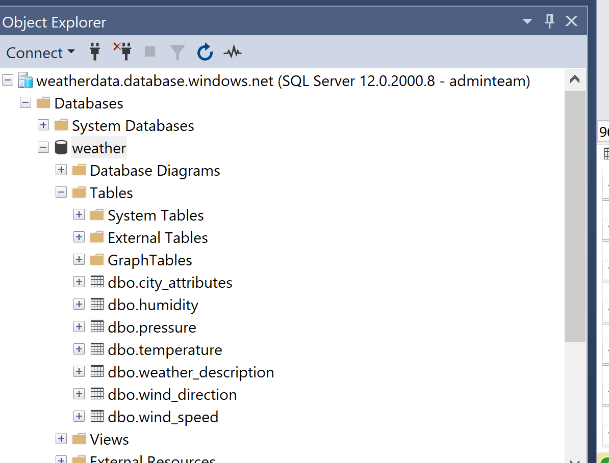
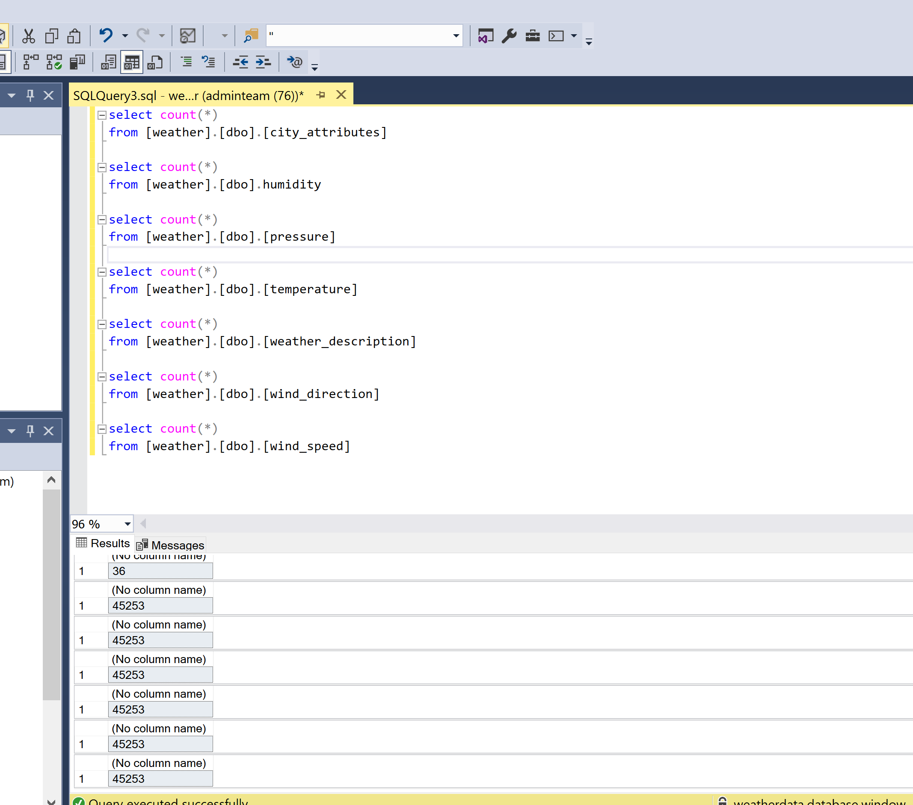

### Roles

* Database - Lea
* GitHub - Eli
* Python - Melani
* Tableau – David

###Project Description

Predict weather type based of historical weather data for charlotte.

###Data Sources

https://www.kaggle.com/datasets/selfishgene/historical-hourly-weather-data?select=weather_description.csv

###Communication Protocols

Slack channel

###ML model(s) mockup
* Regression
* Clustering
* Functional API for Sequential (Neural Net) 

###Database Mockup

SQL hosted on Azure

### Notes so far 5/12/2022

1) Database:
Our database below is setup and all our data is imported, see images below
weatherdata.database.windows.net
Login: adminteam
Password: 9191Team1

2) Python:
We have a python script called ImportDataAndTrainModel.ipynb all the data from the database has been loaded into dataframes.  We have also outlined the basic Exploratory Data Analysis in the script.

3) Branches:  
We have all created seperate branches
